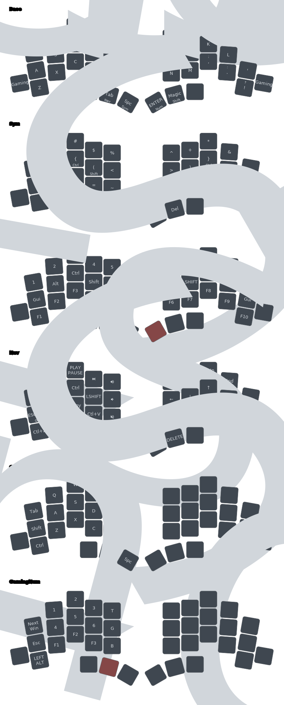

# Nix Powered Totem ZMK Config


This repository contains a ZMK (Zephyr Mechanical Keyboard) configuration
tailored for the Totem keyboard. It leverages the power of Nix for reproducible
builds and automation, making it easy to manage firmware development and
deployment.

## Table of Contents

- [Nix Powered Totem ZMK Config](#nix-powered-totem-zmk-config)
  - [Table of Contents](#table-of-contents)
    - [Features](#features)
    - [Setup](#setup)
      - [Pre-requisites](#pre-requisites)
      - [Set up the workspace](#set-up-the-workspace)
    - [Current keymap](#current-keymap)

### Features

- **Automated Builds**: Firmware is automatically built on every commit using Nix.
- **Release Automation**: Automatically generates releases from the latest build.
- **Keymap Previews**: Automatically generates a visual preview of the keymap on commit.
- **Local Builds**: Easily build firmware locally using Nix.
- **Keymap Editor Compatibility**: Fully compatible with the
  [KeymapEditor](https://nickcoutsos.github.io/keymap-editor/).
- **Homerow Mods**: Includes timeless homerow mods from urob.
- **Dongle Support**: Default build includes support for the Seeeduino Xiao BLE dongle.

### Setup

#### Pre-requisites

1. Install the `nix` package manager:

   ```bash
   # Install Nix with flake support enabled
   curl --proto '=https' --tlsv1.2 -sSf -L https://install.determinate.systems/nix |
      sh -s -- install --no-confirm

   # Start the nix daemon without restarting the shell
   . /nix/var/nix/profiles/default/etc/profile.d/nix-daemon.sh
   ```

2. Install [`direnv`](https://direnv.net/) (and optionally but recommended
   [`nix-direnv`](https://github.com/nix-community/nix-direnv)[^4]) using your
   package manager of choice. E.g., using the `nix` package manager that we just
   installed[^5]:

   ```
   nix profile install nixpkgs#direnv nixpkgs#nix-direnv
   ```

3. Set up the `direnv` [shell-hook](https://direnv.net/docs/hook.html) for your
   shell. E.g., for `bash`:

   ```bash
   # Install the shell-hook
   echo 'eval "$(direnv hook bash)"' >> ~/.bashrc

   # Enable nix-direnv (if installed in the previous step)
   mkdir -p ~/.config/direnv
   echo 'source $HOME/.nix-profile/share/nix-direnv/direnvrc' >> ~/.config/direnv/direnvrc

   # Optional: make direnv less verbose
   echo '[global]\nwarn_timeout = "2m"\nhide_env_diff = true' >> ~/.config/direnv/direnv.toml

   # Source the bashrc to activate the hook (or start a new shell)
   source ~/.bashrc
   ```

#### Set up the workspace

1. Clone _your fork_ of this repository. I like to name my local clone
   `zmk-workspace` as it will be the toplevel of the development environment.

   ```bash
   # Replace `urob` with your username
   git clone https://github.com/talarys/zmk-config zmk-workspace
   ```

2. Enter the workspace and set up the environment.

   ```bash
   # The first time you enter the workspace, you will be prompted to allow direnv
   cd zmk-workspace

   # Allow direnv for the workspace, which will set up the environment (this takes a while)
   direnv allow

   # Initialize the Zephyr workspace and pull in the ZMK dependencies
   # (same as `west init -l config && west update && west zephyr-export`)
   just init

   # Finally just run:
   just build all
   ```

### Current keymap


